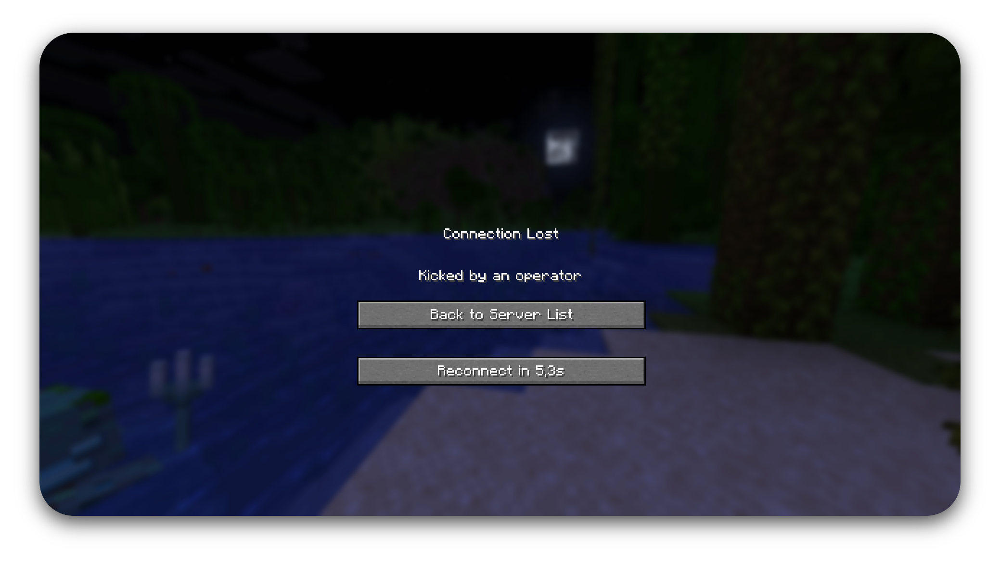
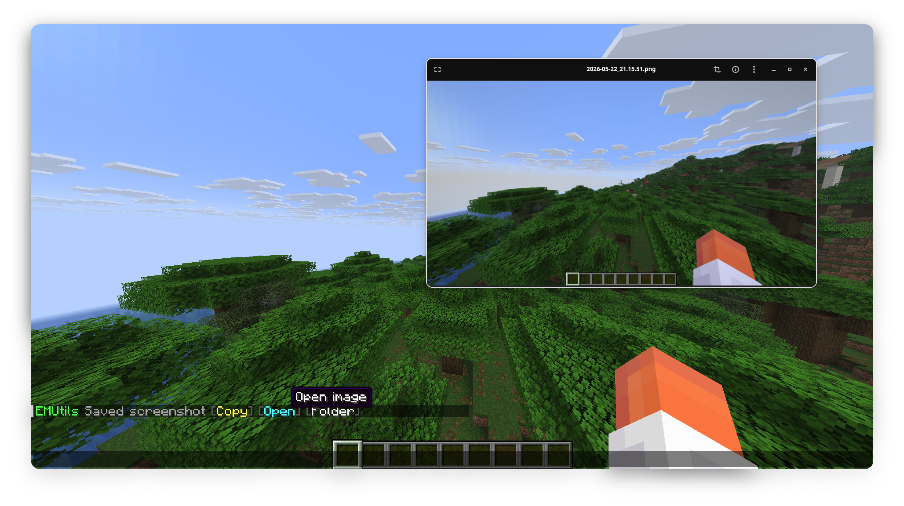
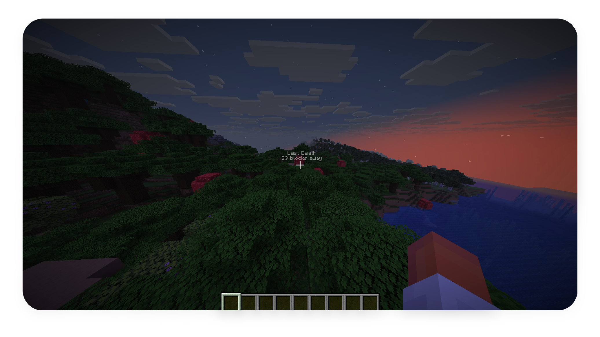
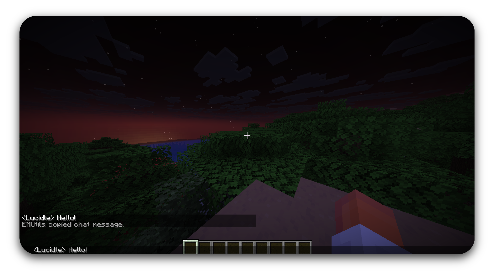

<p align="center">
  
</p>

<h1 align="center">EMUtils</h1>

<p align="center">
  A lightweight client-side utilities mod for <strong>Minecraft 1.21.11</strong> on Fabric.
</p>

## Status

EMUtils is currently in early development. The first public build is not ready yet, but the mod is being built around small quality-of-life features that stay out of the way while playing.

## Features

- **Automatic reconnect** — reconnect to the last server after being kicked, with a configurable retry delay.
- **Screenshot helper** — replace the default screenshot message with quick actions, optional auto-copy feedback, and a screenshot gallery for copying or opening recent captures.
- **Death waypoints** — save multiple deaths per world/server with in-world labels, distance text, configurable opacity, nearby removal prompts, and a current-waypoints list with coordinate copying.
- **Chat features** — copy full chat messages with Ctrl + left click, optionally prepend chat timestamps, collapse repeated messages, and show sound/toast alerts when you are mentioned.
- **Settings UI** — vanilla-style hub in **Options → EMUtils...** and Mod Menu, with per-feature detail screens.

## Coming Soon

- **Villager workstation protection** — prevent accidental villager workstation interactions when needed.
- **Inventory safety tools** — protect important items from accidental drops or slot movement.
- **Auto sort** — organize inventories and containers with a quick action.
- **Quick GIF** — record short shareable gameplay clips from a keybind.
- **Keybind wheel** — create profile-based wheel actions that run chat commands or send saved messages.
- **HUD overlays** — optional on-screen utility information, including:
  - Coordinates
  - Chunk and region details
  - Ping / FPS
  - More lightweight overlays over time

## Requirements

- Minecraft 1.21.11
- Fabric Loader 0.16.x or newer
- Fabric API
- Mod Menu

## Installation

1. Install [Fabric Loader](https://fabricmc.net/use/) for Minecraft 1.21.11.
2. Download the latest EMUtils jar once releases are available.
3. Place the jar in your `mods` folder.
4. Launch the game.

## Building

```bash
./gradlew build
```

The built jar will be created in `build/libs/`.

## License

EMUtils is licensed under the [Apache License 2.0](LICENSE).

Copyright 2026 Palethea. If you use, fork, modify, or redistribute EMUtils, keep the original license and attribution notices.

## Screenshots

<p align="center"><strong>Automatic Reconnect</strong></p>

<p align="center"></p>

<p align="center"><strong>Screenshot Helper</strong></p>

<p align="center"></p>

<p align="center"><strong>Death Waypoint</strong></p>

<p align="center"></p>

<p align="center"><strong>Copy Chat</strong></p>

<p align="center"></p>
