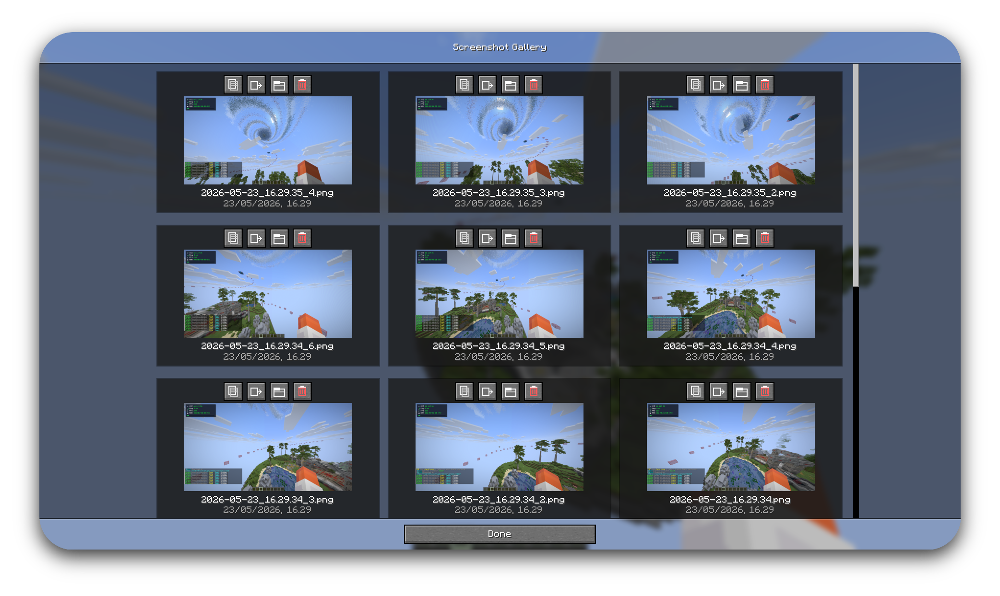
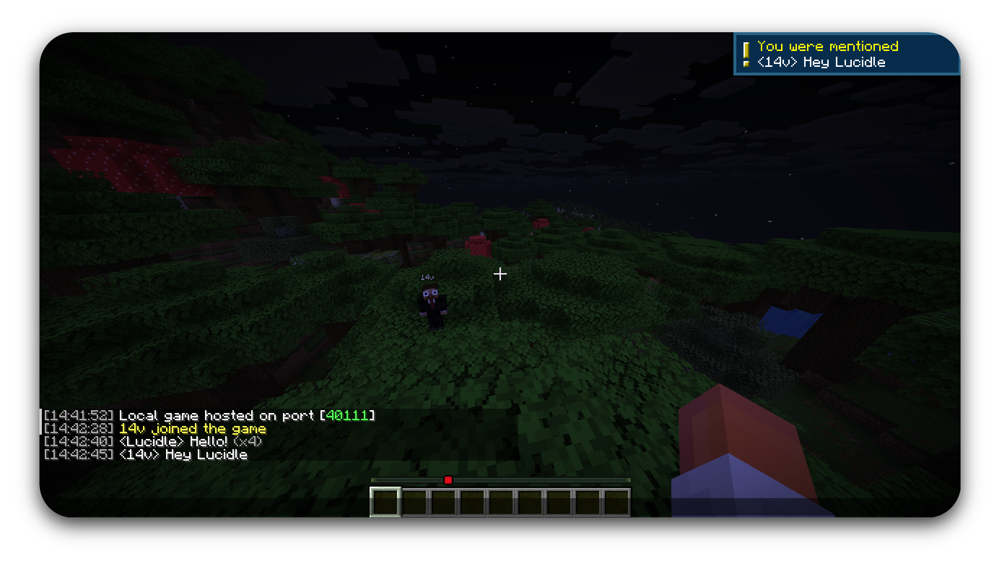

<p align="center">
  
</p>

<h1 align="center">EMUtils</h1>

<p align="center">
  Tired of installing five different mods just to copy a chat message, zoom in, and reconnect after a kick?<br>
  <strong>EMUtils</strong> bundles the small stuff into one lightweight client-side mod for <strong>Minecraft 1.21.11</strong> on Fabric — so you can stop juggling mods and get back to playing.
</p>

## Status

EMUtils is in active development. One vanilla-style settings hub, a pile of quality-of-life features, and zero interest in getting in your way while you play.

## Features

### Minecraft

- **Automatic reconnect** — reconnect to the last server after being kicked, with a countdown button on the disconnect screen, configurable retry delay, limited attempts, or always-retry mode.
- **Screenshot helper** — replace the default screenshot message with quick actions, optional auto-copy feedback, an open-gallery keybind, and a configurable screenshot gallery for copying, opening, sorting, and deleting recent captures.
- **Death waypoints** — save multiple deaths per world/server with in-world labels, distance text, configurable opacity, nearby removal prompts, and coordinate copying in plain, comma-separated, or teleport-command formats.
- **Chat features** — copy full chat messages with Ctrl + left click, optionally prepend chat timestamps, collapse repeated messages, and show sound/toast alerts or subtle highlights when you are mentioned.
- **HUD overlay** — show a configurable styled info panel with icons, selectable screen position, opacity, scale, coordinates, chunk/region, biome, ping, FPS, facing, memory, world time, and local time.
- **Zoom** — hold a configurable keybind for OptiFine-style zoom with adjustable zoom amount, optional smooth fade in/out, cinematic camera smoothing, hide hand, and F1-style HUD hiding while zoomed.
- **Tweaks** — toggle fullbright, clear weather, no fog, clear underwater/lava vision, no environment fog, no hurt cam, freelook, and shulker or bundle tooltip previews.
- **Pack Manager** — browse installed and Modrinth resource packs and shader packs in-game, download into Minecraft's pack folders, delete installed packs, enable/disable resource packs, and apply or turn off Iris shader packs when Iris is installed.
- **Script Manager** — when Minescript is installed, browse `minecraft/minescript`, create/edit Python scripts, run them locally through Minescript, and assign EMUtils-managed per-script keybinds.
- **Custom capes** — show player capes from OptiFine, LabyMod, MinecraftCapes, Cosmetica, and Cloaks+, with per-provider toggles and a preferred provider selector when you have more than one.
- **Spotify player** — show the current Spotify track in the pause menu and optional HUD overlay when Spotify is running (Linux, macOS, and Windows).
- **Inventory Tools** — lock slots, bind hotbar-safe slot swaps, show a small in-game inventory preview above the hotbar, and keep the mouse cursor in place when switching between container screens instead of resetting to center. Slot locks and bindings persist per world/server.
- **Settings UI** — vanilla-style hub in **Options → EMUtils...**, with per-feature detail screens. Mod Menu integration is supported when Mod Menu is installed.

### Hypixel Skyblock

- **Storage previews** — remember what's in your backpacks and ender chest, and show a quick preview when you hover the menu item. Each Skyblock profile keeps its own saves.

## Coming Soon

### Minecraft

- **Food HUD** — saturation and exhaustion overlays on the hunger bar, plus hunger and saturation values on food tooltips.
- **Villager workstation protection** — prevent accidental villager workstation interactions when needed.
- **Auto sort** — organize inventories and containers with a quick action.
- **Quick GIF** — record short shareable gameplay clips from a keybind.
- **Keybind wheel** — create profile-based wheel actions that run chat commands or send saved messages.

### Hypixel Skyblock

- **Bazaar price tags** — show Bazaar prices on item tooltips.
- **Auction House price tags** — show Auction House prices on item tooltips.

## Requirements

- Minecraft 1.21.11
- Java 21 or newer
- Fabric Loader 0.19.2 or newer
- Fabric API

### Optional integrations

- **Mod Menu** — adds an EMUtils button on the mod list screen (the in-game hub works without it)
- **Iris** — required for Pack Manager shader apply/disable actions
- **Minescript** — required for Script Manager browsing, editing, running, and EMUtils script keybinds

## Installation

1. Install [Fabric Loader](https://fabricmc.net/use/) for Minecraft 1.21.11.
2. Download the latest EMUtils jar from releases.
3. Place the jar in your `mods` folder.
4. Launch the game.

## Building

```bash
./gradlew build
```

The built jar will be created in `build/libs/`.

## License

EMUtils is licensed under the [Apache License 2.0](LICENSE).

Copyright 2026 Palethea. If you use, fork, modify, or redistribute EMUtils, keep the original license and attribution notices.

## Screenshots

<p align="center"><strong>Screenshot Gallery</strong></p>

<p align="center"></p>

<p align="center"><strong>Death Waypoint</strong></p>

<p align="center"></p>

<p align="center"><strong>Copy Chat</strong></p>

<p align="center"></p>

<p align="center"><strong>Chat Features</strong></p>

<p align="center"></p>
